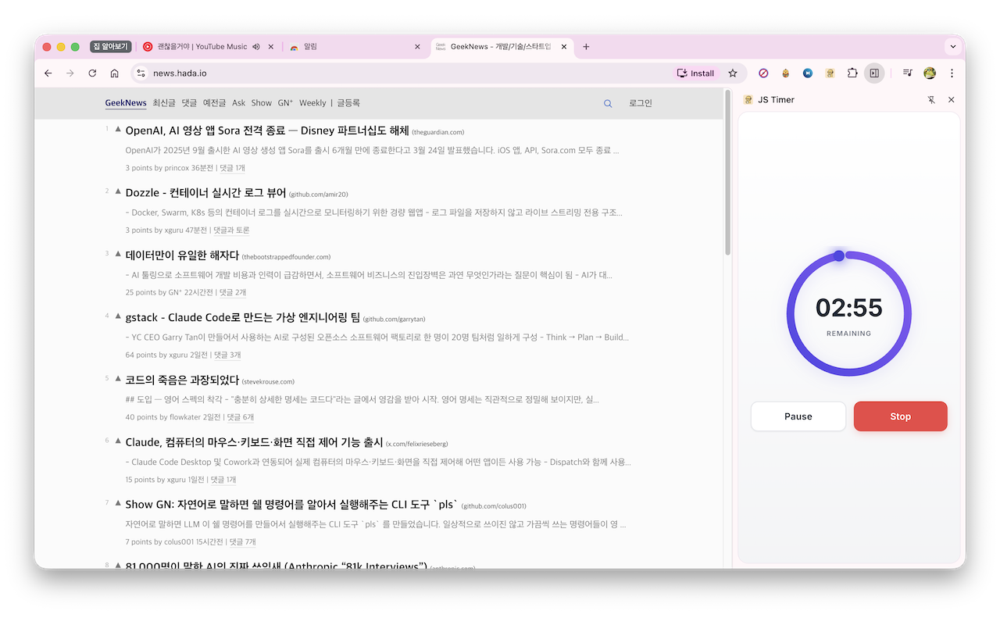
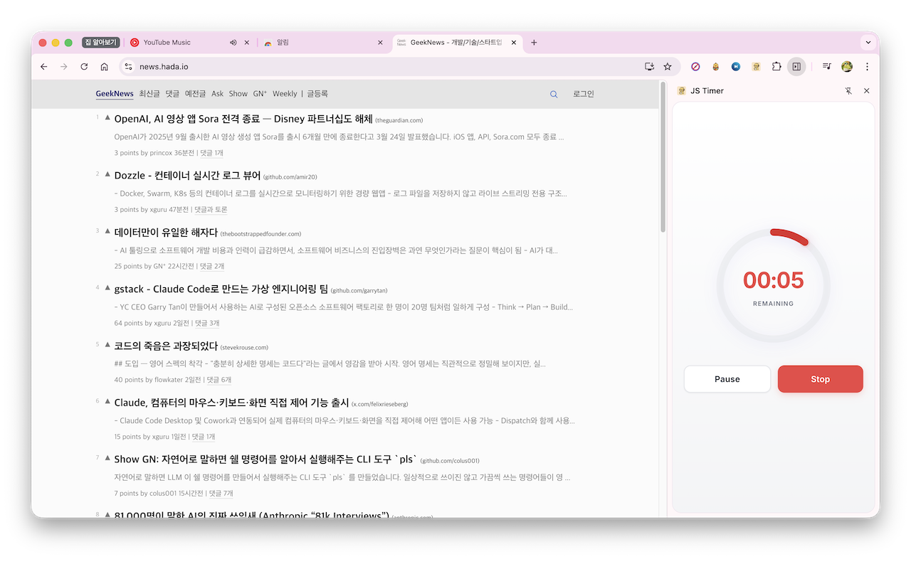

# JS Timer - Chrome Extension

A clean countdown timer that lives in your browser's side panel.




## Features

- **Side Panel** — stays visible across tabs while you browse
- **Animated Progress Ring** — color changes from indigo → amber → red as time runs out
- **Glowing Dot** — tracks progress along the ring, blinks in the last 10 seconds
- **Quick Presets** — 1m, 3m, 5m, 10m, 25m one-click buttons
- **Custom Input** — set hours, minutes, seconds with keyboard or ▲▼ buttons
- **Pause / Resume / Stop** controls
- **Desktop Notification** when timer completes
- **Lightweight** — no data collection, everything stored locally

## Install from Chrome Web Store
https://chromewebstore.google.com/detail/js-timer/amdbeioeokmifnogjkapbdmkkincmooh

## Build from Source

```bash
# Install dependencies
npm install

# Build
npm run build

# Watch mode (development)
npm run watch
```

Load the extension:
1. Open `chrome://extensions`
2. Enable **Developer mode**
3. Click **Load unpacked** → select the `dist/` folder

## Tech Stack

- TypeScript
- Webpack
- Chrome Extension Manifest V3
- Chrome Side Panel API

## Privacy

JS Timer collects no data. See [Privacy Policy](PRIVACY_POLICY.md).

## License

MIT
